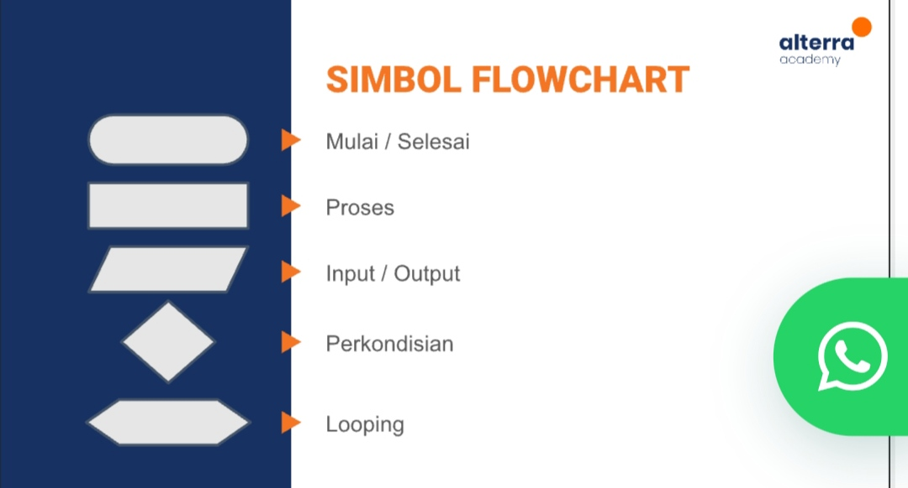
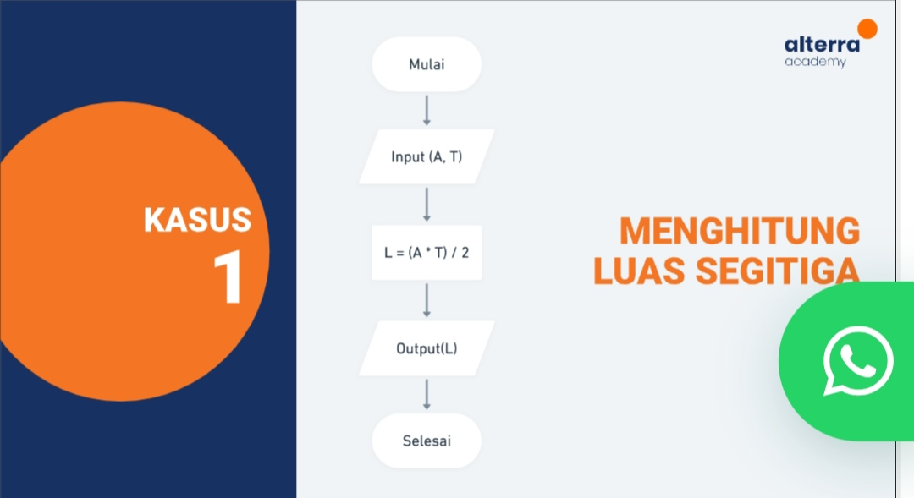

# Rangkuman Introduction Algorithm and Golang
## Algoritma
Algoritma adalah urutan atau langkah-langkah secara sistematis dan terurut untuk menyelesaikan suatu masalah. Algoritma Teridiri dari input, proses dan output.
Berikut beberapa contoh algoritma
<ol>
<li>Mendeteksi bilangan prima</li>
<li>sorting</li>
<li>searching seperti binary search dll</li>
</ol>

## Karakteristik Algoritma
<ol>
<li>memiliki batas</li>
<li>Intruksi terdefinisi dengan baik</li>
<li>Efektif dan efisien</li>
</ol>

## Dasar Dari Algoritma
<ul>
<li>Sequential</li>
Urutan atau langkah-langkah yang terurut dalam menyelesaikan masalah.
<li>Branching</li>
Bagian dari sebuah dasar algoritma dimana menentukan sebuah kondisi apakah benar atau salah atau bisa disebut pilihan kondisi.
<li>Looping</li>
Looping adalah bagian dari dasar algoritma dimana bertujuan untuk mengulang suatu aksi atau statement dengan batasan tertentu.
</ul>

## Pseudocode
Adalah sebuah kode dari algoritma, dimana bahasa yang digunakan adalah bahasa yang mudah dipahami oleh manusia.

## Flowchart
Flowchart adalah suatu bagan dengan simbol tertentu yang menggambarkan urutan atau langkah-langkah dan hubungan antar proses secara mendetail. Flowchart biasanya digunakan untuk menggambarkan alur program atau aplikasi sebelum dibuat.
Berikut ini beberapa simbol flowchart:

<ol>
<li>Terimnator</li>
Terminator adalah salah satu simbol yang digunakan untuk proses awal dan mulai suatu flowchart.
<li>Process</li>
Proses adalah salah satu simbol yang digunakan sebagai proses dari input yang dimasukkan oleh user.
<li>Input / Output</li>
Input atau output atau nama lainnya Data adalah salah satu simbil yang digunakan sebagai input user dan output flowchart.
<li>Decision/Pengkondisian</li>
Adalah sebuah simbol yang digunakan untuk menentukan keputusan dari suatu kondisi.
<li>Looping</li>
Adalah sebuah simbol yang digunakan untuk mengulang sebuah alur selama kondisi iterasi atau perulangan terpenuhi.
</ol>

## Contoh Soal Flowchart

Contoh soal diatas membahas mengenai menghitung luas segitiga. Untuh langkah awal dari intruksi flowchart, peserta memasukkan alas dan tinggi. Kemudia terjadi proses dari input yang sudah dimasukkan oleh user, setelah itu terdapat keluaran output luast segitiga dan flowchart selesai.