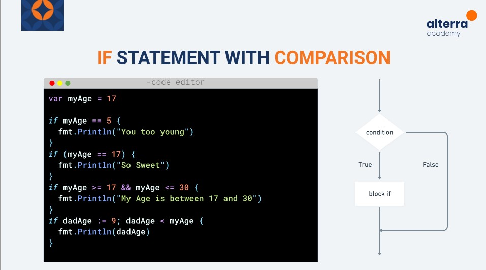
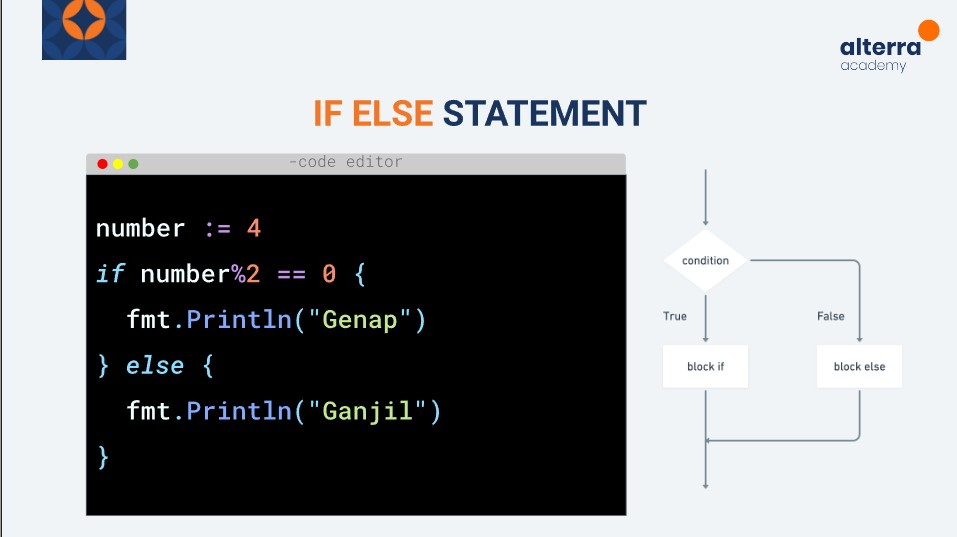
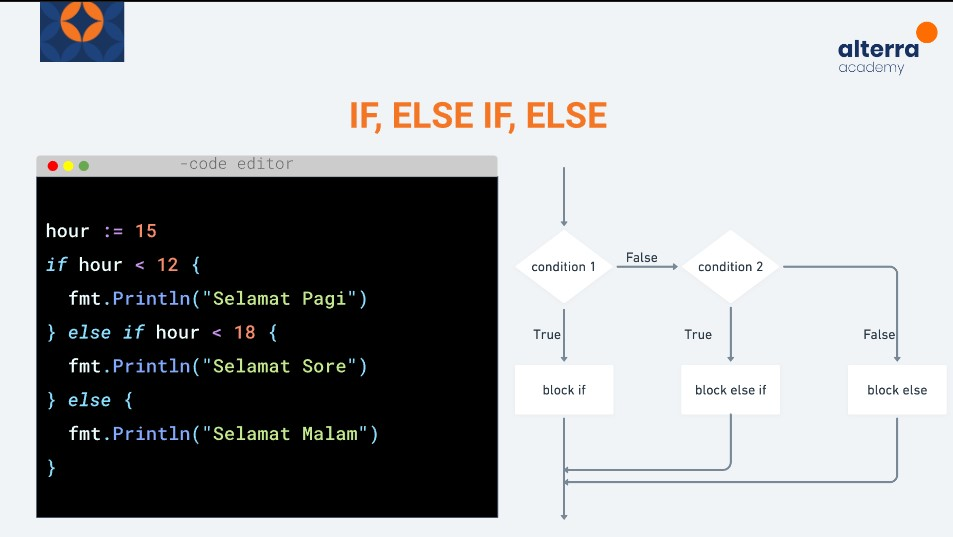
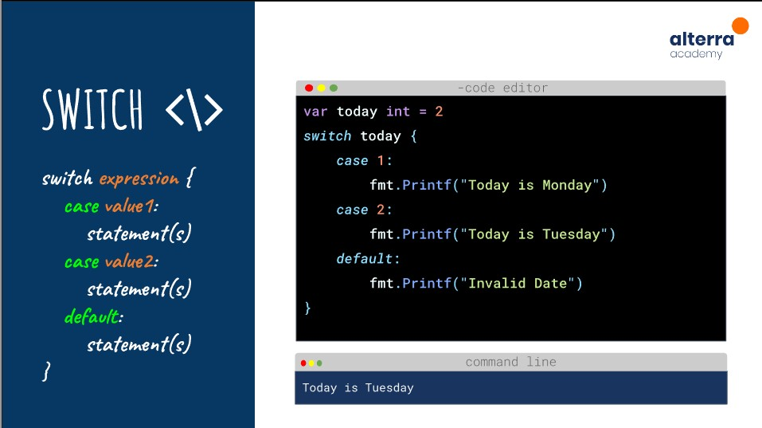
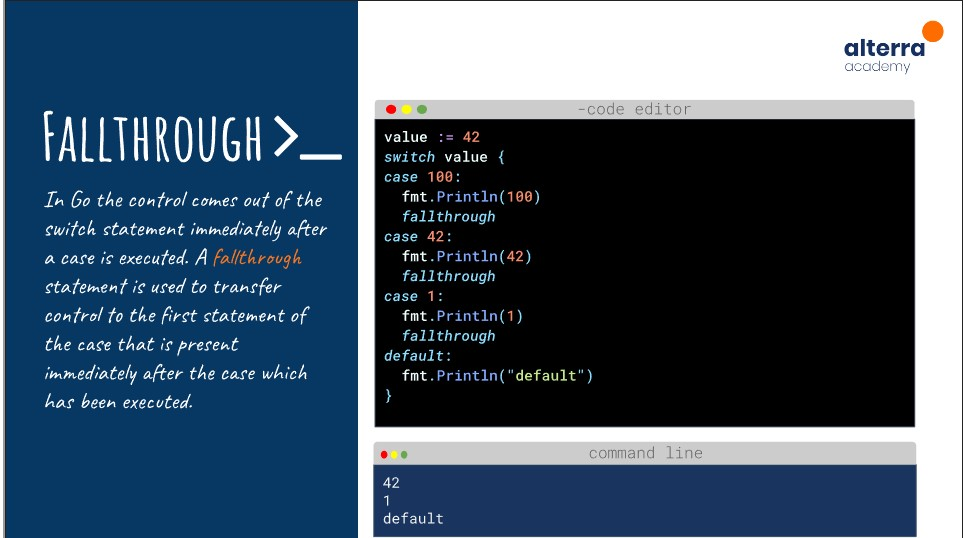

# Rangkuman Basic Programming

## Definisi Golang
Secara umum, golang adalah bahasa pemrograman yang mudah untuk dibangun, mudah, dapat diandalkan dan efisiensi perangkat lunak.

## System Programming
Golang biasa digunakan untuk membuat berbagai macam program.
Berikut adalah contohnya :

**Program Aplikasi**
<ol>
<li>Ecommerce</li>
<li>Music Player</li>
<li>Social Media Apps</li>
</ol>

**System Programs**
<ol>
<li>APIs</li>
<li>Game Engines</li>
<li>CLI apps</li>
</ol>

## GO WORKSPACE
Untuk membuat project go, kita dianjurkan untuk membuat folder sesuai anjuran. Diantaranya terdiri dari folder bin, pkg dan src.
<ul>
<li>bin</li>
Folder bin berisi binary executable hasil build.
<li>pkg</li>
Folder ini digunakan untuk menampung package-package hasil instalan.
<li>src</li>
Folder src digunakan untuk menampung project golang
</ul>

## COMMAND GO TERMINAL
<ul>
<li>go run</li>
go run digunakan untuk menjalankan program yang berekstensi go.
<li>go build</li>
go build digunakan untuk mengkompile files.
<li>go get</li>
go get digunakan untuk menginstall beberapa package untuk membangun aplikasi atau program go.
</li>
<li>go test</li>
go test digunakan untuk testing program.
<li>go install</li>
Seperti go build digunakan untuk melanjutkan proses penginstalan.
</ul>

## Main Sintaks
go setidaknya berisi package main, import fmt dan function main. Pada function main ini program dijalankan.

## Variabel
Variabel digunakan untuk menyimpan informasi pada program computer, biasanya variabel memiliki nama dan tipe data.
Golang terdiri dari tiga variabel, diantaranya string, number dan boolean. Untuk number masih teridir dari beberapa tipe, ada integer, float dan complex.

## Type declaration
**Long Variabel**
<ul>
<li>var nama_variabel type_data</li>
<li>var nama_variabel type_data = value</li>
<li>var list_nama_variabel type_data</li>
<li>var list_nama_variabel type_data = value</li>
</ul>

**Short Variabel**
<ul>
<li>nama_variabel := value</li>
</ul>

## Zero Values

Beberapa tipe data pada bahasa pemrograman go memiliki zero valuenya sendiri, diantaranya :

string =""
integer=0
float=0
boolean=false
## Operator

Pada bahasa pemrograman go terdiri dari beberapa operator di go. Diantaranya ada operator aritmatika, operator perbandingan, operator logika, operator bitwise, operator assignment dan operator miscellaneous.

## Control Structure Branching and Looping
Hanya ada beberapa struktur kontrol dalam pada go. Untuk percabangan kita menggunakan if dan switch dan untuk menulis perulangan kita menggunakan keyword for.

Pada contoh soal diatas adalah bentuk dari percabangan if statement, apabila kondisi dalam if terpenuhi maka program akan masuk kedalam blok kode dan menjalan apa yang ada dalam blok tersebut dimana contoh di gambar tersebut terdapat output untuk mencetak kalimat.

Pada contoh soal diatas adalah bentuk dari percabangan if else statement, apabila kondisi dalam if tidak terpenuhi maka program akan masuk kedalam blok kode else dan akan menjalankan kode yang ada pada else.

Pada contoh soal diatas adalah bentuk dari percabangan else if statement, apabila kondisi dalam if tidak terpenuhi maka program akan mengecek kondisi kode else if. Namun apabila pada kondisi else if tidak ada yang terpenuhi maka program akan menampilkan output dari blok kode else.

Pada contoh soal diatas adalah bentuk dari percabangan switch. Percabangan switch adalah percabangan dengan kondisi yang lebih simple, biasanya dibandingkan perdasarkan kesamaan dari expression.

Sedangkan fallthrought biasanya digunakan untuk memaksa blok kode untuk tetap dijalankan apabila program sudah masuk ke dalam case.

## Loops
Adalah sebuah statement yang mana membuat kode untuk diulang berdasarkan kondisi yang telah ditentukan.

Berikut adalah contoh dari Loops diantaranya :
<ul>
<li>for</li>
<li>while</li>
</ul>
Kemudian untuk loop statement biasanya dikombinasikan dengan continue dan break. Continue digunakan untuk memaksa perulangan untuk melanjutkan ke step selanjutnya tanpa menjalankan kode dibawahnya, sedangkan break digunakan untuk memaksa perulangan untuk berhenti.