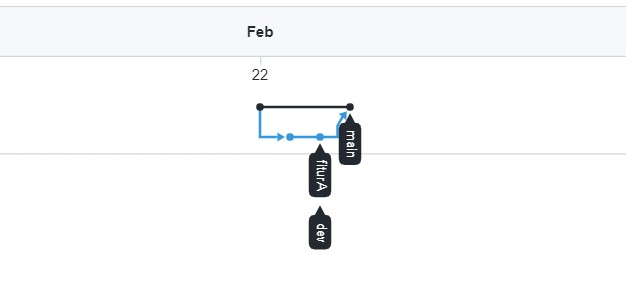

# Jawaban Soal Eksplorasi

## dengan project terserah kalian, praktikkan salah satu workflow serderhana dan buktikan dengan Screenshoot. github flow/gitflow/trunkbase, akan ada foto terkait flow yang disebutkan.

Pada contoh diatas adalah salah satu impelementasi github flow dimana menggunakan tiga branch yaitu branch main, dev, dan fiturA. Berikut adalah link github flow https://github.com/ardin2001/github-flow/network.