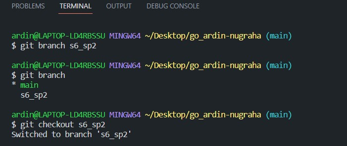
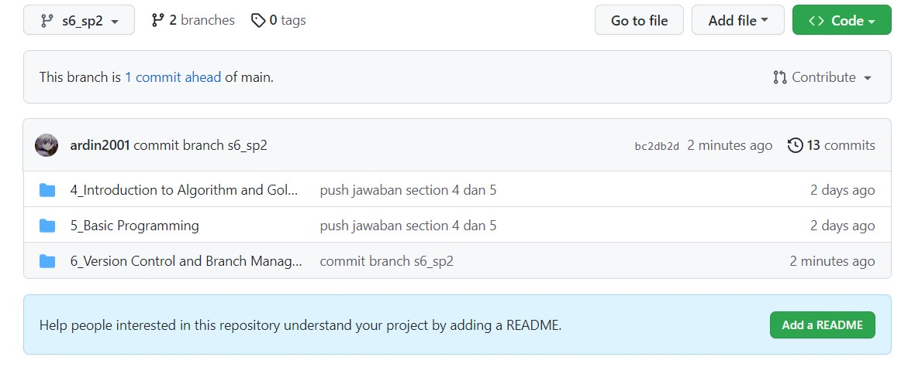

# Jawaban Soal Prioritas 1

## Buatlah branch baru pada github yang kalian buat

Pada gambar diatas saya telah membuat branch baru dengan perintah git branch [nama branch], kemudian saya ketikkan perintah git branch untuk melihat apakah branch tersebut sudah dibuat. Karena branch s6_sp2 telah berhasil dibuat kemudian saya melakukan perintah git checkout agar saya berpindah ke branch s6_sp2.

Berikut adalah branch s6_sp2 yang terlihat pada halaman github dengan repository go_ardin-nugraha.