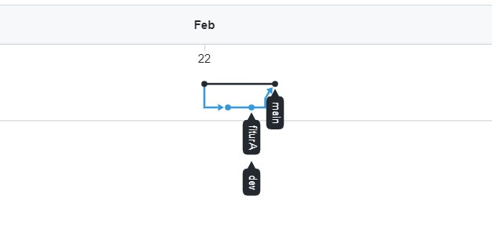
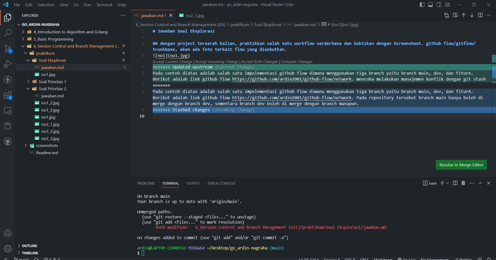
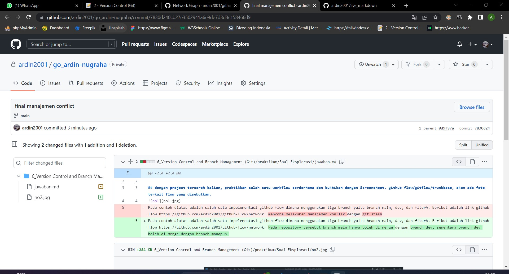

# Jawaban Soal Eksplorasi

## dengan project terserah kalian, praktikkan salah satu workflow serderhana dan buktikan dengan Screenshoot. github flow/gitflow/trunkbase, akan ada foto terkait flow yang disebutkan.

Pada contoh diatas adalah salah satu impelementasi github flow dimana menggunakan tiga branch yaitu branch main, dev, dan fiturA. Berikut adalah link github flow https://github.com/ardin2001/github-flow/network. Pada repository tersebut branch main hanya boleh di merge dengan branch dev, sementara branch dev boleh di merge dengan branch manapun.

## lakukan management konflik pada github

pada gambar tersebut terdapat manajemen conflict, dimana terdapat pilihan Accept Current Change, Accept Incoming Changes, Accept Both Changes dan Compare Changes.

## Lakukan code review pada github yang kalian kumpulkan, terdapat foto seperti apa itu code review

Berikut adalah salah satu contoh code review pada salah satu commit repository.