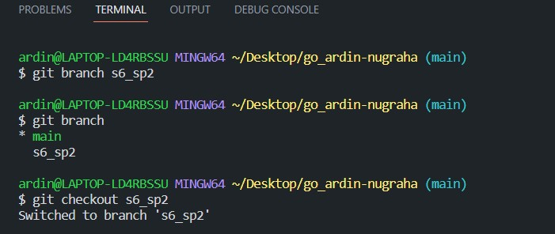
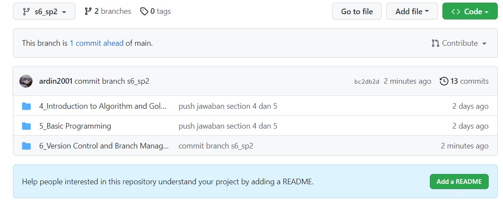
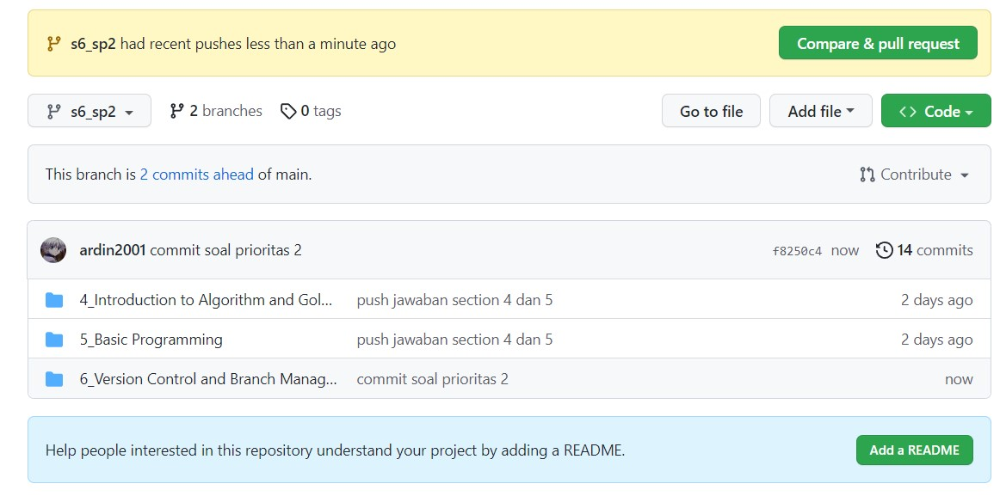
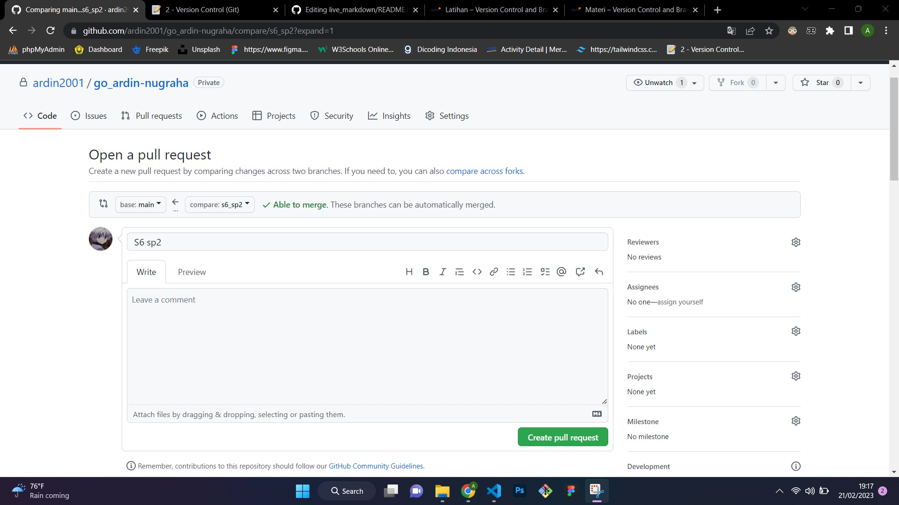
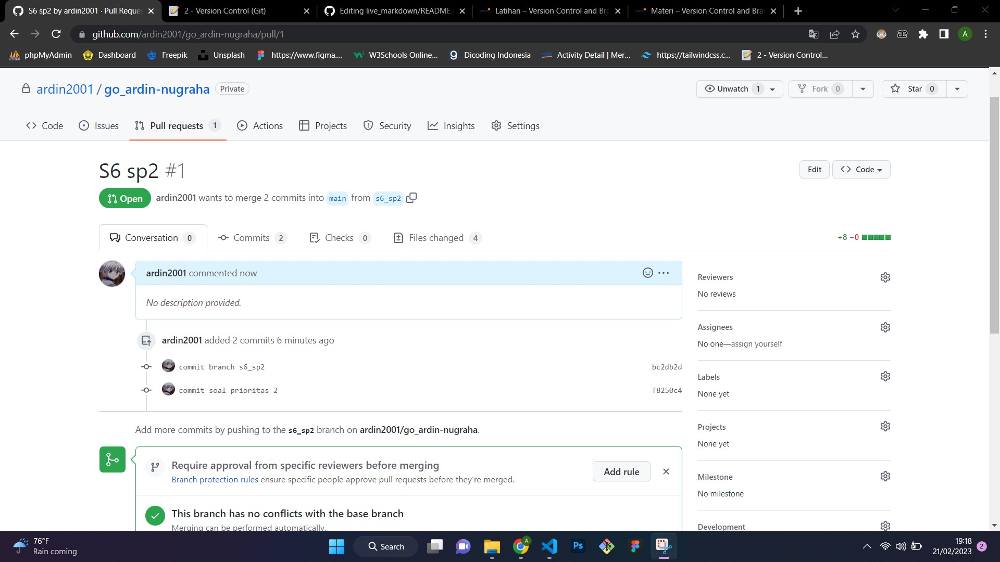

# Jawaban Soal Prioritas 2

## Buatlah branch baru pada github yang kalian buat

Pada gambar diatas saya telah membuat branch baru dengan perintah git branch [nama branch], kemudian saya ketikkan perintah git branch untuk melihat apakah branch tersebut sudah dibuat. Karena branch s6_sp2 telah berhasil dibuat kemudian saya melakukan perintah git checkout agar saya berpindah ke branch s6_sp2.

Berikut adalah branch s6_sp2 yang terlihat pada halaman github dengan repository go_ardin-nugraha.

## Lakukan Pull Request pada branch tersebut sehingga akan menambah hal baru pada branch main/master. terdapat foto terkait Pull Request

Untuk melakukan pull request branch s6_sp2 ke branch main. Langkah awal yaitu tekan Compare&pull request tombol berwarna hijau tersebut.

Kemudian akan diarahkan ke halaman seperti contoh gambar diatas, kemudian tekan tombol warna hijau create pull request.

Kemudian masuk ke bagian menu Pull request dan cari tombol hijau merge pull agar isi file yang berada pada branch s6_sp2 bisa juga terdapat pada branch main.